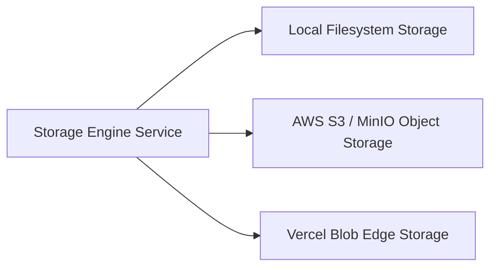

# Multi-Driver Storage Engine Feature Report

## Overview
Nirmaanify AI features a **Multi-Driver Storage Engine** capable of switching storage backends on the fly between **Local Filesystem**, **AWS S3 / MinIO**, and **Vercel Blob Storage** with zero downtime and unified file management APIs.

---

## Supported Storage Drivers



1. **Local Filesystem (`local`)**:
   - Stores assets directly in `.storage/uploads/` on the server host.
   - Ideal for local offline development, testing, and isolated environments.
2. **AWS S3 / MinIO (`s3`)**:
   - Production-grade S3 compatible bucket storage with multi-region distribution and presigned URLs.
3. **Vercel Blob Storage (`vercel-blob`)**:
   - Low-latency edge CDN media storage with automatic optimization and instant global availability.

---

## 1-Click Hot Switcher API

### Endpoint: `POST /api/v1/storage/switch`
- **Protected By**: `@UseGuards(JwtAuthGuard, RolesGuard)`, `@Roles('OWNER', 'ADMIN')`
- **Payload**:
  ```json
  {
    "driver": "s3"
  }
  ```
- **Response**:
  ```json
  {
    "message": "Active storage driver switched to s3",
    "driver": {
      "type": "s3",
      "name": "AWS S3 / MinIO Object Storage",
      "isConfigured": true,
      "isActive": true
    }
  }
  ```

---

## File Operations

| Operation | Endpoint | RBAC Guard | Description |
| :--- | :--- | :--- | :--- |
| **List Files** | `GET /api/v1/storage/files` | Authenticated | Lists all files in active storage |
| **Upload File** | `POST /api/v1/storage/upload` | Developer+ | Multipart file upload with automated metadata indexing |
| **Get / Stream** | `GET /api/v1/storage/files/:key`| Public / Auth | Streams binary file content with inline disposition |
| **Delete File** | `DELETE /api/v1/storage/files/:key` | Developer+ | Deletes file from active storage driver |
