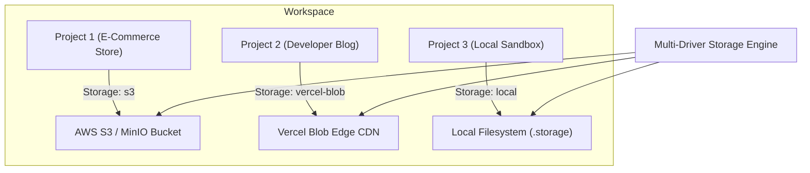

# Multi-Driver Storage Engine Feature Report

## Overview
Nirmaanify AI features a **Multi-Driver Storage Engine** with **Project-Individual Dynamic Storage Architecture**. Instead of forcing a single global storage configuration across all projects in a workspace (which causes configuration conflicts and mismatches), each project independently specifies, configures, and dynamically switches its own dedicated storage driver between **Local Filesystem**, **AWS S3 / MinIO**, and **Vercel Blob Storage** with zero downtime and unified file management APIs.

---

## Project-Individual Dynamic Architecture



### Key Advantages of Project-Individual Storage:
1. **No Workspace-Level Conflicts**: Project A can utilize enterprise AWS S3 buckets, while Project B uses high-speed Vercel Edge Blob storage, and Project C uses offline local disk without interfering with one another.
2. **Project Namespace Isolation**: Uploaded files and assets are scoped under `projects/{projectId}/...`, preventing filename collisions and guaranteeing tenant/project data separation.
3. **Dynamic Hot-Switching**: Any project can change its storage driver on the fly via UI or API (`POST /api/v1/storage/switch` with `projectId`) without restarting backend services.
4. **Scaffolding & Creation Integration**: Storage engines can be selected at project creation (`CreateProjectDialog`), modified at any time in project settings, and monitored in the project dashboard.

---

## Supported Storage Drivers

1. **Local Filesystem (`local`)**:
   - Stores assets directly in `.storage/projects/{projectId}/` on the server host.
   - Ideal for local offline development, testing, and isolated environments.
2. **AWS S3 / MinIO (`s3`)**:
   - Production-grade S3 compatible bucket storage with multi-region distribution and presigned URLs.
3. **Vercel Blob Storage (`vercel-blob`)**:
   - Low-latency edge CDN media storage with automatic optimization and instant global availability.

---

## 1-Click Hot Switcher API

### Endpoint: `POST /api/v1/storage/switch`
- **Protected By**: `@UseGuards(JwtAuthGuard, RolesGuard)`, `@Roles('OWNER', 'ADMIN', 'DEVELOPER')`
- **Payload (Project-Specific)**:
  ```json
  {
    "driver": "s3",
    "projectId": "d8c1c4f5-7e88-4674-a035-64f331b26f8d"
  }
  ```
- **Response**:
  ```json
  {
    "message": "Project \"AI Video Studio\" storage switched to s3",
    "project": {
      "id": "d8c1c4f5-7e88-4674-a035-64f331b26f8d",
      "name": "AI Video Studio",
      "storageDriver": "s3"
    },
    "driver": {
      "name": "s3",
      "label": "AWS S3 / MinIO",
      "isConfigured": true,
      "isActive": true,
      "description": "AWS S3, MinIO, Cloudflare R2, or DigitalOcean Spaces compatible object storage."
    }
  }
  ```

---

## File Operations Scoped to Project

| Operation | Endpoint | RBAC Guard | Description |
| :--- | :--- | :--- | :--- |
| **Storage Status** | `GET /api/v1/storage/status?projectId=:id` | Authenticated | Returns active driver for the specific project |
| **List Files** | `GET /api/v1/storage/files?projectId=:id` | Authenticated | Lists all files scoped to the project's driver and prefix |
| **Upload File** | `POST /api/v1/storage/upload` | Developer+ | Multipart upload with `projectId` field isolated to project driver |
| **Get / Stream** | `GET /api/v1/storage/files/:key?projectId=:id`| Public / Auth | Streams binary file content using the project's driver |
| **Delete File** | `DELETE /api/v1/storage/files/:key?projectId=:id` | Developer+ | Deletes file from project's storage driver |
