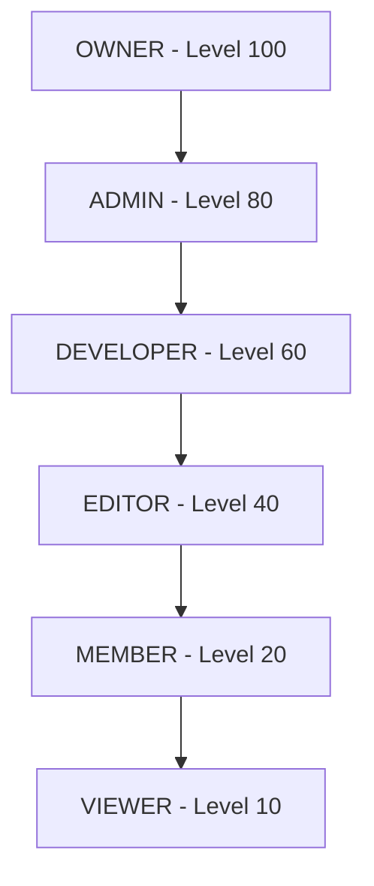

# Role-Based Access Control (RBAC) Feature Report

## Overview
Nirmaanify AI implements a multi-tier **Role-Based Access Control (RBAC)** architecture operating across the types package, backend NestJS API guards, and frontend React UI component gates.

---

## 1. Role Hierarchy Matrix



### Hierarchy Breakdown:

| Role | Level | Description | Key Permissions |
| :--- | :---: | :--- | :--- |
| **`OWNER`** | 100 | Workspace Creator / Root Admin | Full control, billing, workspace deletion, driver switching |
| **`ADMIN`** | 80 | Workspace Administrator | Member invitations, member removals, project management, storage switching |
| **`DEVELOPER`** | 60 | Active Builder / Engineer | Project creation, editing, code generation, storage uploads/deletions |
| **`EDITOR`** | 40 | Content Editor | Project edits, storage viewing and uploads |
| **`MEMBER`** | 20 | Regular Team Member | Read and participate in assigned projects |
| **`VIEWER`** | 10 | Read-Only Stakeholder | Read-only inspection of projects and workspace assets |

---

## 2. Granular Permissions Registry

Defined in `packages/types/src/rbac.ts`:

- **Workspace Operations**:
  - `WORKSPACE_CREATE`, `WORKSPACE_MANAGE`, `WORKSPACE_DELETE`, `WORKSPACE_VIEW`
- **Member Management**:
  - `MEMBER_INVITE`, `MEMBER_REMOVE`, `MEMBER_ROLE_CHANGE`
- **Project Engineering**:
  - `PROJECT_CREATE`, `PROJECT_EDIT`, `PROJECT_DELETE`, `PROJECT_VIEW`, `PROJECT_DEPLOY`
- **Storage & Infrastructure**:
  - `STORAGE_VIEW`, `STORAGE_UPLOAD`, `STORAGE_DELETE`, `STORAGE_SWITCH_DRIVER`
- **Billing & Administration**:
  - `BILLING_MANAGE`

---

## 3. Backend API RBAC (`apps/api`)

### Decorators & Guard:
- `@Roles(...roles: UserRole[])`: Declares role requirements on controller handlers.
- `@RequirePermissions(...permissions: Permission[])`: Declares specific permission requirements.
- `RolesGuard`: Evaluates authenticated user JWT claims against handler metadata.

### Protected Endpoints Example:
```ts
// apps/api/src/workspaces/workspaces.controller.ts
@Post(':id/invites')
@UseGuards(JwtAuthGuard, RolesGuard)
@Roles('OWNER', 'ADMIN')
async inviteMember(@Param('id') id: string, @Body() dto: InviteMemberDto) {
  return this.workspacesService.inviteMember(id, dto);
}

// apps/api/src/storage/storage.controller.ts
@Post('switch')
@UseGuards(JwtAuthGuard, RolesGuard)
@Roles('OWNER', 'ADMIN')
async switchDriver(@Body() body: SwitchDriverDto) {
  return this.storageService.setActiveDriver(body.driver);
}
```

---

## 4. Frontend RBAC (`apps/web`)

### A. The `useRBAC()` Hook
```tsx
import { useRBAC } from '@/hooks/use-rbac';

export const MyComponent = () => {
  const { role, isOwner, isAdmin, isDeveloper, canInviteMembers, canSwitchStorageDriver } = useRBAC();

  return (
    <div>
      {canInviteMembers && <Button>Invite Team Member</Button>}
    </div>
  );
};
```

### B. Declarative Component Gates
```tsx
import { RoleGate, PermissionGate, RoleBadge } from '@/components/auth';

// Restrict entire block to Owners & Admins
<RoleGate allowedRoles={['OWNER', 'ADMIN']} fallback={<p>Admin authorization required.</p>}>
  <StorageDriverSwitcher ... />
</RoleGate>

// Restrict by specific permission
<PermissionGate permission="MEMBER_INVITE">
  <InviteMemberDialog ... />
</PermissionGate>

// Render styled role badge
<RoleBadge role={user.role} showIcon />
```
