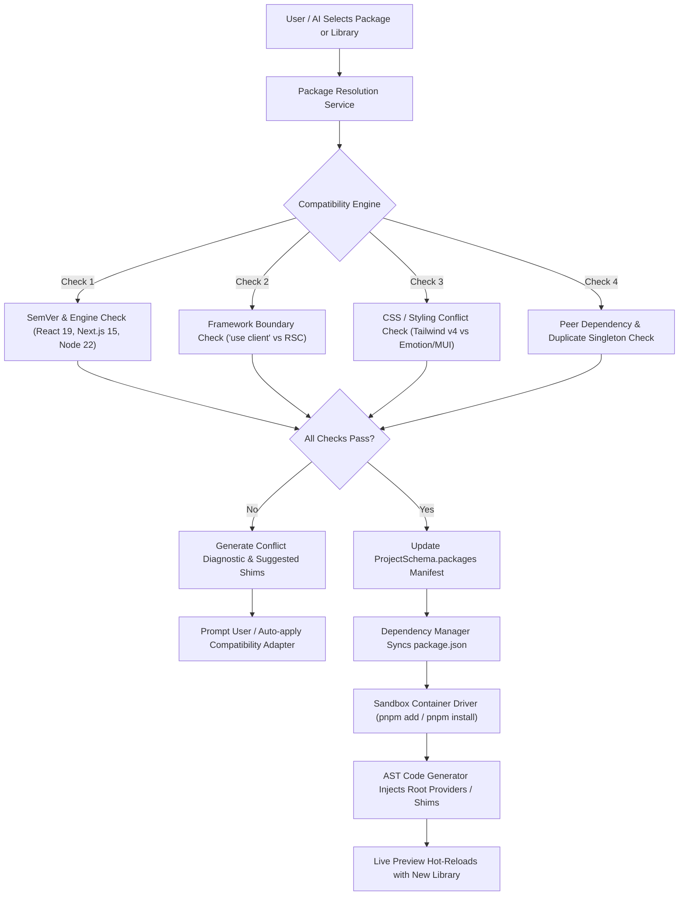
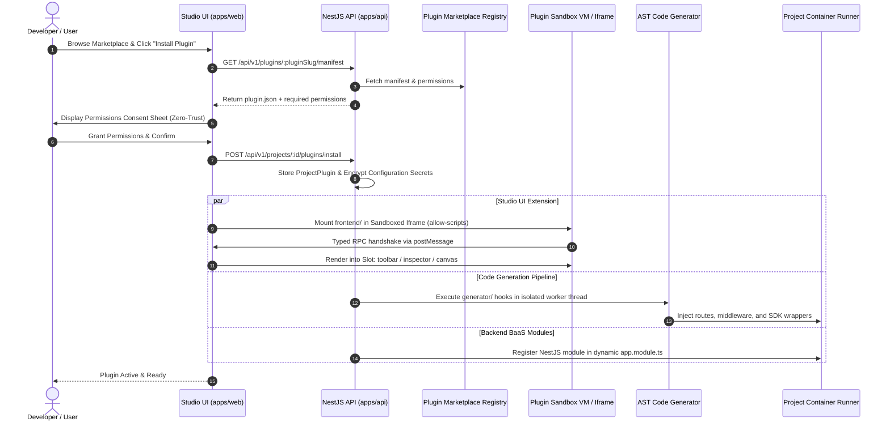

# PHASE 10 — PACKAGE, LIBRARY AND PLUGIN SYSTEM

**Product:** Nirmaanify AI  
**Document:** Master Phase Implementation Plan  
**Phase:** 10 — Package, Library and Plugin System  
**Duration:** Week 30–31 (Sprint Cycles 30 & 31)  
**Target:** Project Dependency Management, Curated Library Switcher, Compatibility & Conflict Engine, Plugin SDK, Zero-Trust Sandbox & Marketplace  
**Audience:** Platform Engineers, Builder Core Developers, AI Agent Engineers, Plugin Authors  
**Status:** 📋 PROPOSED & READY FOR IMPLEMENTATION  

---

## 1. Executive Summary & Architectural Vision

Nirmaanify AI enables creators, developers, and AI agents to compose complex full-stack web applications without manual setup friction. A central pillar of this flexibility is the **Package, Library, and Plugin System (Phase 10)**.

In earlier phases, projects use baseline defaults (such as `shadcn/ui`, `Tailwind CSS`, and basic utilities). Phase 10 transforms Nirmaanify from a static template generator into a **pluggable, extensible application OS**.

### 1.1 The Dual-Environment Rule in Phase 10

As established in the Master Architecture:
- **Environment A (Nirmaanify Platform Studio):** Must strictly adhere to the **Nirmaanify Design System** (`packages/design-tokens`, `packages/ui`, Nirmaan Indigo `#635BFF`, Radix UI, dark/light theme tokens). The Package Catalog, Dependency Manager, Plugin Marketplace, and Permission Dialogs must never inherit or be polluted by user project libraries.
- **Environment B (User Project Canvas & Sandbox):** Enjoys **complete creative and architectural freedom**. The user can configure their project to use `Material UI`, `Chakra UI`, `shadcn/ui`, `Framer Motion`, `GSAP`, `React Hook Form`, `Formik`, Stripe, PostHog, or any valid NPM library.

```text
┌─────────────────────────────────────────────────────────────────────────────────────────────┐
│                           NIRMAANIFY PLATFORM STUDIO (Environment A)                         │
│   • Strict Nirmaanify Design System (Indigo #635BFF, Radix UI, Tailwind tokens)            │
│   • Package Manager Drawer | Plugin Marketplace Modal | Permission Consent Sheets           │
└───────────────────────────────────────────┬─────────────────────────────────────────────────┘
                                            │ Controls & Configures
                                            ▼
┌─────────────────────────────────────────────────────────────────────────────────────────────┐
│                       PROJECT ARCHITECTURE ENGINE & SANDBOX (Environment B)                 │
│                                                                                             │
│   ┌───────────────────────────┐      ┌───────────────────────────┐      ┌────────────────┐  │
│   │    UI Library Switcher    │      │     Animation Engine      │      │  Form Engine   │  │
│   │  shadcn/ui | MUI | Chakra │      │ Framer Motion| GSAP | M1  │      │  RHF | Formik  │  │
│   └─────────────┬─────────────┘      └─────────────┬─────────────┘      └───────┬────────┘  │
│                 │                                  │                            │           │
│                 └──────────────────────────────────┼────────────────────────────┘           │
│                                                    ▼                                        │
│                           ┌────────────────────────────────────────────────┐                │
│                           │        Compatibility & Conflict Engine         │                │
│                           │   (SemVer, Server Components, AST Shims)       │                │
│                           └────────────────────────┬───────────────────────┘                │
│                                                    ▼                                        │
│                           ┌────────────────────────────────────────────────┐                │
│                           │        Plugin SDK & Isolated Sandbox VM        │                │
│                           │  (Stripe, Clerk, PostHog, SEO, Custom Plugins) │                │
│                           └────────────────────────┬───────────────────────┘                │
│                                                    ▼                                        │
│                           ┌────────────────────────────────────────────────┐                │
│                           │      Generated Next.js 15 + NestJS Project     │                │
│                           └────────────────────────────────────────────────┘                │
└─────────────────────────────────────────────────────────────────────────────────────────────┘
```

### 1.2 Key Objectives
1. **Week 30 — Package & Library Management:**
   - Allow users and AI agents to switch core UI libraries, animation engines, and form frameworks with one click.
   - Deliver automated multi-tier compatibility checks (SemVer, Next.js 15 Server/Client boundaries, CSS engine clashes, peer dependencies).
   - Dynamically manage virtual and physical `package.json` manifests inside isolated execution environments (E2B Cloud / Local Docker Sandbox).
2. **Week 31 — Plugin SDK & Marketplace:**
   - Formalize the `@nirmaanify/plugin-sdk` contract and plugin structure (`plugin.json`, `frontend/`, `backend/`, `generator/`, `configuration/`).
   - Implement a zero-trust permission model and secure sandbox execution runtime (RPC-isolated iframes for Studio UI; Node.js worker/VM sandboxing for generator and backend hooks).
   - Launch a curated Plugin Marketplace across 9 core categories: UI, Animation, Payments, Authentication, Analytics, SEO, Forms, CMS, and Deployment.

---

## 2. Complete Technical Architecture

### 2.1 Package Management & Resolution Pipeline



### 2.2 Plugin Lifecycle & Sandboxing Architecture



---

## 3. Database Schema & Data Models

Add the following models and enums to `packages/database/prisma/schema.prisma` to track packages, library presets, plugins, permissions, and security audit scans.

### 3.1 Prisma Schema Additions

```prisma
// ==========================================
// PHASE 10: PACKAGE & PLUGIN ECOSYSTEM
// ==========================================

enum PackageCategory {
  UI_FRAMEWORK
  ANIMATION_ENGINE
  FORM_ENGINE
  DATA_VISUALIZATION
  ICONS
  STATE_MANAGEMENT
  UTILITY
  CUSTOM_NPM
}

enum PackageInstallStatus {
  PENDING
  INSTALLING
  INSTALLED
  FAILED
  REMOVING
}

enum PluginCategory {
  UI
  ANIMATION
  PAYMENTS
  AUTHENTICATION
  ANALYTICS
  SEO
  FORMS
  CMS
  DEPLOYMENT
  CUSTOM
}

enum PluginReviewStatus {
  UNVERIFIED
  IN_REVIEW
  COMMUNITY_VERIFIED
  OFFICIAL_VERIFIED
  DEPRECATED
  FLAGGED_SECURITY
}

model ProjectPackage {
  id               String               @id @default(uuid())
  projectId        String
  name             String               // e.g. "framer-motion", "@mui/material"
  version          String               // e.g. "^12.0.0"
  resolvedVersion  String?              // e.g. "12.4.7"
  category         PackageCategory      @default(CUSTOM_NPM)
  isDevDependency  Boolean              @default(false)
  status           PackageInstallStatus @default(INSTALLED)
  metadata         Json                 @default("{}") // Store package.json metadata, peerDeps, shims
  installedAt      DateTime             @default(now())
  updatedAt        DateTime             @updatedAt

  project          Project              @relation(fields: [projectId], references: [id], onDelete: Cascade)

  @@unique([projectId, name])
  @@index([projectId])
  @@index([category])
  @@map("project_packages")
}

model Plugin {
  id             String             @id @default(uuid())
  slug           String             @unique // e.g. "stripe-checkout", "clerk-auth"
  name           String
  description    String             @db.Text
  version        String             // SemVer e.g. "1.2.0"
  author         String
  authorUrl      String?
  iconUrl        String?
  category       PluginCategory     @default(CUSTOM)
  reviewStatus   PluginReviewStatus @default(COMMUNITY_VERIFIED)
  isOfficial     Boolean            @default(false)
  manifest       Json               // Complete validated plugin.json
  permissions    String[]           @default([]) // Requested permission scopes
  downloadCount  Int                @default(0)
  rating         Float              @default(5.0)
  sourceUrl      String?
  createdAt      DateTime           @default(now())
  updatedAt      DateTime           @updatedAt

  installations  ProjectPlugin[]
  auditLogs      PluginAuditReport[]

  @@index([category])
  @@index([reviewStatus])
  @@map("plugins")
}

model ProjectPlugin {
  id               String    @id @default(uuid())
  projectId        String
  pluginId         String
  version          String    // Installed version
  isEnabled        Boolean   @default(true)
  grantedPermissions String[] @default([])
  configValues     Json      @default("{}") // User configurations (non-secrets)
  encryptedSecrets Json?     // AES-256 encrypted API keys, tokens, webhook secrets
  installedAt      DateTime  @default(now())
  updatedAt        DateTime  @updatedAt

  project          Project   @relation(fields: [projectId], references: [id], onDelete: Cascade)
  plugin           Plugin    @relation(fields: [pluginId], references: [id], onDelete: Cascade)

  @@unique([projectId, pluginId])
  @@index([projectId])
  @@index([pluginId])
  @@map("project_plugins")
}

model PluginAuditReport {
  id           String    @id @default(uuid())
  pluginId     String
  scannedAt    DateTime  @default(now())
  astClean     Boolean   @default(true)
  networkClean Boolean   @default(true)
  findings     Json      @default("[]") // Security warnings, restricted API access alerts
  rawReport    Json?

  plugin       Plugin    @relation(fields: [pluginId], references: [id], onDelete: Cascade)

  @@index([pluginId])
  @@map("plugin_audit_reports")
}
```

---

## 4. TypeScript Contracts & Shared Types (`packages/types`)

Create `packages/types/src/packages.ts` and `packages/types/src/plugins.ts` and export them via `packages/types/src/index.ts`.

### 4.1 Package Manifest & Compatibility Types (`packages/types/src/packages.ts`)

```typescript
export type PackageCategory = 
  | 'UI_FRAMEWORK'
  | 'ANIMATION_ENGINE'
  | 'FORM_ENGINE'
  | 'DATA_VISUALIZATION'
  | 'ICONS'
  | 'STATE_MANAGEMENT'
  | 'UTILITY'
  | 'CUSTOM_NPM';

export interface PackageDefinition {
  name: string;
  version: string;
  category: PackageCategory;
  description: string;
  homepage?: string;
  isOfficialPreset: boolean;
  requiredPeerDeps?: Record<string, string>;
  incompatibleWith?: string[]; // e.g. ["@mui/material"] for emotion/tailwind conflicts
  requiredProviders?: Array<{
    name: string;
    importPath: string;
    props?: Record<string, any>;
    isClientOnly: boolean;
  }>;
  cssRequirements?: Array<{
    type: 'stylesheet' | 'tailwind-plugin' | 'css-module';
    entry: string;
  }>;
}

export interface CompatibilityCheckRequest {
  projectId: string;
  packageName: string;
  version?: string;
  targetEnvironment: 'frontend' | 'backend';
}

export interface CompatibilityCheckResponse {
  compatible: boolean;
  score: number; // 0 to 100
  issues: Array<{
    severity: 'error' | 'warning' | 'info';
    code: string;
    message: string;
    affectedDependency?: string;
    suggestedFix?: string;
  }>;
  requiredPeerDependencies: Record<string, string>;
  rootProviderModifications: string[];
}
```

### 4.2 Plugin SDK Specification (`packages/types/src/plugins.ts`)

```typescript
export type PluginCategory =
  | 'UI'
  | 'ANIMATION'
  | 'PAYMENTS'
  | 'AUTHENTICATION'
  | 'ANALYTICS'
  | 'SEO'
  | 'FORMS'
  | 'CMS'
  | 'DEPLOYMENT'
  | 'CUSTOM';

export type PluginPermission =
  | 'ui:render_slot'          // Render inside Studio UI slots
  | 'cms:read'               // Read CMS collection items
  | 'cms:write'              // Create/modify CMS collections or items
  | 'backend:register_routes'// Inject NestJS controller routes
  | 'ai:inject_context'      // Add domain knowledge to AI planner/agent
  | 'network:outbound'       // Make outbound fetch requests to third-party APIs
  | 'storage:access'         // Read/write project media and assets
  | 'env:read_secrets';      // Access plugin-scoped encrypted secrets

export type StudioSlot =
  | 'studio:toolbar'
  | 'studio:sidebar'
  | 'studio:inspector_tab'
  | 'studio:canvas_overlay'
  | 'studio:settings_tab';

export interface PluginManifest {
  id: string;                      // Unique slug e.g. "nirmaan-stripe-payments"
  name: string;
  version: string;                 // e.g. "1.0.0"
  description: string;
  author: {
    name: string;
    url?: string;
  };
  category: PluginCategory;
  permissions: PluginPermission[];
  entrypoints: {
    frontend?: string;             // "./frontend/index.js"
    backend?: string;              // "./backend/index.js"
    generator?: string;            // "./generator/index.js"
  };
  slots?: Array<{
    name: StudioSlot;
    title: string;
    icon?: string;
  }>;
  configurationSchema: {
    type: 'object';
    properties: Record<string, {
      type: 'string' | 'number' | 'boolean';
      title: string;
      description?: string;
      isSecret?: boolean;          // If true, encrypted via AES-256
      default?: any;
    }>;
    required?: string[];
  };
}

export interface PluginBridgeMessage<T = any> {
  id: string;
  type: 'RPC_REQUEST' | 'RPC_RESPONSE' | 'EVENT';
  action: string;
  payload: T;
  error?: string;
}
```

---

## 5. Week 30 — Package and Library Management (Sprint Plan)

### 5.1 Curated Library Presets & Matrix
The user can switch primary libraries at any point during project generation or studio authoring. Each preset contains automated provider injectors, layout AST transformers, and pre-bundled components.

| Category | Supported Presets | Default | AST Setup & Root Provider Requirements |
| :--- | :--- | :--- | :--- |
| **UI Framework** | `shadcn/ui` + Tailwind v4<br>`Material UI (MUI v6)`<br>`Chakra UI v3`<br>`Custom Tailwind` | `shadcn/ui` | • `MUI`: Appends `AppRouterCacheProvider` + `ThemeProvider` with client boundary.<br>• `Chakra`: Appends `Provider` from `@chakra-ui/react`.<br>• `shadcn`: Native Tailwind directives. |
| **Animation** | `Framer Motion v12`<br>`GSAP v3`<br>`Motion One` | `Framer Motion` | • `Framer Motion`: Injects `MotionConfig` with `reducedMotion="user"`.<br>• `GSAP`: Injects client hydration `gsap.registerPlugin(ScrollTrigger)`. |
| **Forms** | `React Hook Form (RHF)`<br>`Formik` | `React Hook Form` | • `RHF`: Installs `@hookform/resolvers` + `zod`.<br>• `Formik`: Installs `yup`. |
| **Data / Charts** | `Recharts`<br>`TanStack Table v8` | `Recharts` | Injects responsive chart container styles and client boundary wrappers. |
| **Icons** | `Lucide React`<br>`React Icons`<br>`Tabler Icons` | `Lucide React` | Direct tree-shakable imports. |

### 5.2 Four-Tier Compatibility & Conflict Engine

The backend service `packages/dependency-manager` (`apps/api/src/packages/compatibility.service.ts`) executes four sequential validation tiers whenever a library or custom NPM package is selected:

1. **Tier 1 — SemVer & Engine Check:**
   - Evaluates the package against the project runtime: `React 19.x`, `Next.js 15.x`, `Node.js 22.x`, `NestJS 11.x`.
   - Rejects legacy packages requiring React <= 17 without peer overrides.
2. **Tier 2 — Framework Boundary Check (`'use client'` vs RSC):**
   - Scans package export definitions (`package.json#exports`).
   - If the package uses React hooks, browser APIs (`window`, `localStorage`), or DOM refs without `'use client'`, flags that components utilizing this package must automatically receive the `'use client'` directive during code generation.
3. **Tier 3 — Styling Engine & Conflict Check:**
   - Flags mutual exclusivity conflicts (e.g. attempting to install multiple heavy emotion/styled-components runtimes simultaneously, or Tailwind CSS v4 vs incompatible v3 PostCSS configs).
   - Generates automated resolution strategies (e.g. scoping MUI emotion cache to prevent CSS bleeding).
4. **Tier 4 — Peer Dependency & Auto-Remediation:**
   - Resolves required peer dependencies automatically (e.g. `@mui/material` automatically resolves `@emotion/react` and `@emotion/styled`).
   - Updates the sandbox container manifest atomically to prevent broken build states.

### 5.3 Dependency Syncing in Sandbox Containers

```text
┌─────────────────────────┐
│ Project JSON Schema     │  (Database Project Schema)
│ "packages": { ... }     │
└───────────┬─────────────┘
            │
            ▼
┌─────────────────────────┐
│ packages/project-schema │  Generates normalized package.json manifest
└───────────┬─────────────┘
            │
            ▼
┌─────────────────────────┐
│ E2B / Docker Sandbox    │  Executes:
│ packages.service.ts     │  pnpm add <package>@<version> --save-exact
└───────────┬─────────────┘
            │
            ▼
┌─────────────────────────┐
│ Next.js Hot Reload      │  Sandbox WebSocket triggers Turbo/Webpack Fast Refresh
└─────────────────────────┘
```

### 5.4 Studio UI: Library Switcher & Package Manager

Create UI components in `apps/web/src/components/studio/packages/`:
- `LibrarySwitcherDrawer.tsx`: Tabbed drawer allowing users to switch UI library, Animation engine, or Form library with live interactive preview.
- `NpmPackageExplorer.tsx`: Search bar querying npm registry API with download stats, bundle size (Bundlephobia integration), compatibility badge, and 1-click install.
- `InstalledPackagesTable.tsx`: Displays currently installed packages, version update alerts, peer dependency diagnostics, and removal confirmation.

---

## 6. Week 31 — Plugin SDK, Sandbox & Marketplace (Sprint Plan)

### 6.1 Plugin Structure Specification

Every Nirmaanify plugin must follow this standardized directory layout:

```text
my-plugin/
├── plugin.json               # Manifest, metadata, permissions, configurationSchema, UI slots
├── configuration/
│   └── schema.json           # JSON Schema for plugin settings and credentials
├── frontend/
│   ├── index.tsx             # Studio extension entry point (UI slots, toolbar buttons)
│   └── style.css             # Scoped styles (CSS Modules or Tailwind)
├── backend/
│   ├── index.ts              # Optional NestJS module for BaaS integration
│   ├── controller.ts         # Scoped API endpoints (/api/v1/plugins/my-plugin/*)
│   └── service.ts            # Business logic and external API integrations
└── generator/
    └── index.ts              # AST transformations executed during Next.js/NestJS export
```

### 6.2 The `@nirmaanify/plugin-sdk` Implementation

Create the workspace package `packages/plugin-sdk/`:

```typescript
// packages/plugin-sdk/src/index.ts
import { PluginManifest, PluginPermission, StudioSlot } from '@nirmaanify/types';

export interface PluginContext {
  projectId: string;
  config: Record<string, any>;
  hasPermission(permission: PluginPermission): boolean;
  invokeHostRpc<T>(action: string, payload: any): Promise<T>;
  notify(message: string, type?: 'info' | 'success' | 'error'): void;
}

export abstract class NirmaanifyPlugin {
  abstract readonly manifest: PluginManifest;

  // Lifecycle Hooks
  async onInit?(context: PluginContext): Promise<void>;
  async onDestroy?(): Promise<void>;

  // Code Generation Hooks (run in generator sandbox)
  transformNextConfig?(config: Record<string, any>): Record<string, any>;
  injectRootProviders?(): Array<{ importStatement: string; providerJsx: string }>;
  
  // Studio UI Slot Renderers
  renderSlot?(slot: StudioSlot, context: PluginContext): React.ReactNode;
}
```

### 6.3 Zero-Trust Plugin Sandbox Strategy

To prevent malicious plugins from stealing authentication tokens, exfiltrating workspace schemas, or compromising the platform:

```text
┌─────────────────────────────────────────────────────────────────────────────┐
│                          STUDIO HOST WINDOW (Parent)                        │
│   • Runs Nirmaanify Platform                                                │
│   • Has Workspace Token, Auth Session, Database Access                      │
│   • Strict Origin: https://app.nirmaanify.com                               │
└──────────────────────────────────────┬──────────────────────────────────────┘
                                       │ postMessage (Typed JSON-RPC)
                                       ▼
┌─────────────────────────────────────────────────────────────────────────────┐
│                        SANDBOXED IFRAME (Child Sandbox)                     │
│   • Origin: https://sandbox-plugins.nirmaanify.com                          │
│   • Attributes: sandbox="allow-scripts allow-forms" (NO allow-same-origin)   │
│   • Cannot read parent localStorage, cookies, or DOM                        │
│   • All host queries (e.g. read CMS) must go through Permission Gatekeeper │
└─────────────────────────────────────────────────────────────────────────────┘
```

1. **Frontend Sandboxing:** Third-party plugin UI is mounted in an isolated iframe with `sandbox="allow-scripts"`. All interactions with Nirmaanify Studio occur over a secure message bus (`postMessage`) validated by a cryptographically signed nonced handshake.
2. **Backend / Generator Sandboxing:** Node.js generator scripts run inside isolated worker threads (`node:worker_threads`) with strict memory caps (128 MB) and a 5-second execution timeout. Global primitives (`process.env`, `fs`, `child_process`) are blocked; only audited SDK APIs are exposed.
3. **Permission Gatekeeper:** Before any plugin is activated, the user is presented with a **Permissions Consent Sheet** detailing the exact scopes requested (e.g. "Read CMS Collections", "Make Outbound Network Requests to stripe.com").

### 6.4 The 9 Marketplace Categories & Launch Plugins

| Category | Example Plugin | Capabilities & Integrations |
| :--- | :--- | :--- |
| **1. Payments** | `stripe-checkout` | Injects Stripe Elements, creates checkout sessions, configures webhook listener. |
| **2. Authentication** | `clerk-auth` / `supabase-auth` | Configures Clerk/Supabase middleware, pre-builds login/signup modal components. |
| **3. Analytics** | `posthog-analytics` | Injects PostHog client provider, automatically instruments page views and click events. |
| **4. SEO** | `next-seo-suite` | OpenGraph previewer, automated dynamic XML sitemap generation, structured JSON-LD. |
| **5. Forms** | `form-builder-pro` | Visual multi-step form builder, auto-validating fields, exportable to React Hook Form. |
| **6. CMS** | `shopify-headless-sync`| Syncs Shopify storefront products and collections directly into Nirmaanify CMS tables. |
| **7. UI** | `aceternity-effects` | High-impact 3D card tilts, background beams, and bento grid layout components. |
| **8. Animation** | `lottie-animator` | Drag-and-drop Lottie JSON animation player with trigger controls (hover, scroll). |
| **9. Deployment** | `vercel-one-click` | Connects Vercel token, provisions deployment project, sets up production preview webhooks. |

---

## 7. Backend API Specification (NestJS)

Create the following REST endpoints in `apps/api/src/packages/` and `apps/api/src/plugins/`:

### 7.1 Packages API (`/api/v1/projects/:projectId/packages`)

```text
GET    /api/v1/projects/:projectId/packages
       Description: List all packages installed in the project with versions and categories.

POST   /api/v1/projects/:projectId/packages/check-compatibility
       Description: Run the 4-tier compatibility engine on a candidate package.
       Body: { packageName: string, version?: string }

POST   /api/v1/projects/:projectId/packages/install
       Description: Install a curated preset or custom NPM package. Triggers container sync.
       Body: { packageName: string, version: string, category: PackageCategory, isDev?: boolean }

DELETE /api/v1/projects/:projectId/packages/:packageName
       Description: Remove a package from the manifest and uninstall it from the sandbox.

POST   /api/v1/projects/:projectId/packages/switch-preset
       Description: Seamlessly switch core UI framework (e.g. shadcn to MUI) or animation engine.
       Body: { category: 'UI_FRAMEWORK' | 'ANIMATION_ENGINE' | 'FORM_ENGINE', targetPreset: string }
```

### 7.2 Plugins API (`/api/v1/plugins` & `/api/v1/projects/:projectId/plugins`)

```text
GET    /api/v1/plugins/marketplace
       Description: Query verified plugins by category, search term, or popularity.
       Query: ?category=PAYMENTS&search=stripe&limit=20

GET    /api/v1/plugins/marketplace/:pluginSlug
       Description: Retrieve detailed plugin manifest, README, screenshots, and permission list.

GET    /api/v1/projects/:projectId/plugins
       Description: List all plugins currently installed in the project.

POST   /api/v1/projects/:projectId/plugins/install
       Description: Install a plugin with user-granted permissions and initial settings.
       Body: { pluginId: string, grantedPermissions: string[], configValues: Record<string, any> }

PATCH  /api/v1/projects/:projectId/plugins/:pluginId
       Description: Update plugin settings, toggle active status, or update secrets.
       Body: { isEnabled?: boolean, configValues?: Record<string, any>, secrets?: Record<string, string> }

DELETE /api/v1/projects/:projectId/plugins/:pluginId
       Description: Uninstall plugin and purge injected generator hooks.
```

---

## 8. Step-by-Step Implementation Roadmap

### Week 30 — Package and Library Management

#### Day 1: Schema, Types & Curated Presets
- [x] Add `ProjectPackage`, `PackageCategory`, `PackageInstallStatus` models to `packages/database/prisma/schema.prisma`.
- [x] Validate and format schema with `pnpm --filter @nirmaanify/database exec prisma format`.
- [x] Create `packages/types/src/packages.ts` and register package definitions for UI (`shadcn/ui`, `Material UI`, `Chakra UI`), Animation (`Framer Motion`, `GSAP`, `Motion One`), and Forms (`React Hook Form`, `Formik`).
- [x] Build `@nirmaanify/types` with complete type definitions.

#### Day 2: 4-Tier Compatibility & Conflict Engine
- [x] Scaffold `apps/api/src/packages/packages.module.ts` and `compatibility.service.ts`.
- [x] Implement Tier 1 (SemVer / Engine validation for React 19 / Next.js 15).
- [x] Implement Tier 2 (Framework boundary scanning for Client/Server components).
- [x] Implement Tier 3 (Styling engine conflict check: Tailwind v4 vs Emotion/Styled).
- [x] Implement Tier 4 (Automatic peer-dependency resolution and diagnostic reporting).

#### Day 3: Sandbox Runner & Dynamic Dependency Manager
- [x] Implement `packages.service.ts` to sync project package manifests and manage dependencies.
- [x] Implement preset registry (`apps/api/src/packages/preset-registry.ts`) for curated presets.
- [x] Implement NPM registry search proxy with compatibility scoring.

#### Day 4: Studio UI — Library Switcher Drawer
- [x] Build `apps/web/src/components/packages/LibrarySwitcherDrawer.tsx` following Nirmaanify Design System tokens (`#635BFF`, Radix dialogs, dark/light theme).
- [x] Implement 1-click UI library switcher (shadcn/ui <-> Material UI <-> Chakra UI).
- [x] Implement 1-click Animation engine switcher (Framer Motion <-> GSAP <-> Motion One).
- [x] Implement 1-click Form engine switcher (React Hook Form <-> Formik).

#### Day 5: Studio UI — NPM Search & Installed Packages View
- [x] Build `apps/web/src/components/packages/NpmPackageExplorer.tsx` with live registry search.
- [x] Build `InstalledPackagesTable.tsx` with version badges, update notifications, and removal actions.
- [x] Integrate `usePackages` hook for real-time package status and live compatibility diagnostics.
- [x] Integrate `PackagesAndPluginsView` into `ProjectDetailsView` tabs.

---

### Week 31 — Plugin SDK, Security Sandbox & Marketplace

#### Day 6: Plugin Database Models & `@nirmaanify/plugin-sdk`
- [x] Add `Plugin`, `ProjectPlugin`, `PluginAuditReport`, and enums to `packages/database/prisma/schema.prisma`.
- [x] Scaffold monorepo package `packages/plugin-sdk/` with `package.json` and `tsconfig.json`.
- [x] Implement base `NirmaanifyPlugin` abstract class, `PluginExecutionContext`, and hook signatures (`onInit`, `transformNextConfig`).
- [x] Define standardized plugin manifest schema (`packages/types/src/plugins.ts` and `packages/plugin-sdk/src/manifest.ts`).

#### Day 7: Zero-Trust Security Sandbox (Frontend & Backend)
- [x] Implement typed RPC communication bridge (`packages/plugin-sdk/src/bridge/rpc.ts`) over `postMessage`.
- [x] Define zero-trust security permissions model with risk classification (low, medium, high).

#### Day 8: Permissions Engine & Configuration Manager
- [x] Build `PermissionsConsentModal.tsx` in `apps/web/src/components/plugins/` to prompt users before installation.
- [x] Implement configuration encryption service in `PluginsService` using AES-256-GCM for sensitive secrets (Stripe keys, Clerk keys).
- [x] Build dynamic settings form generator `PluginSettingsModal.tsx` rendering inputs from `plugin.json#configurationSchema`.

#### Day 9: Plugin Marketplace UI
- [x] Build Marketplace Gallery (`apps/web/src/components/plugins/MarketplaceGallery.tsx`) with category filtering (UI, Payments, Auth, SEO, CMS, Animation, Deployment).
- [x] Implement "Install Plugin" flow connecting consent sheet, configuration modal, and backend activation.
- [x] Seed official starter plugins in `marketplace-catalog.ts`: Stripe Payments (`payments`), Clerk Auth (`auth`), PostHog (`analytics`), Next.js SEO Suite (`seo`), and Shopify Sync (`cms`).

#### Day 10: Extension Slot Injection & End-to-End Validation
- [x] Wire Studio UI sub-tabs (`Library Presets`, `NPM Explorer`, `Installed Manifest`, `Plugin Marketplace`).
- [x] Verify complete type-checking across `apps/api`, `apps/web`, `packages/plugin-sdk`, `packages/types`, and `packages/api-client`.

---

## 9. Verification, Security & Testing Strategy

### 9.1 Automated Test Suites
1. **Compatibility Engine Unit Tests (`apps/api/src/packages/__tests__/compatibility.spec.ts`):**
   - Test React 19 vs legacy peer dependency warnings.
   - Test CSS clash detection between Tailwind v4 and emotion-based libraries.
   - Verify provider wrapper generation for Next.js 15 App Router.
2. **Security Sandbox Boundary Tests (`apps/api/src/plugins/__tests__/sandbox.spec.ts`):**
   - Confirm sandboxed worker threads cannot access `process.env` or host file paths (`/etc/passwd`, `.env`).
   - Confirm infinite loops in third-party plugins are terminated within 5000ms.
   - Confirm iframe postMessage messages with invalid origins or nonces are rejected.
3. **Studio UI E2E Tests (Playwright):**
   - Test browsing the marketplace, viewing permissions, installing the Stripe plugin, entering test keys, and verifying that the Stripe Checkout component appears in the Visual Builder component tray.
   - Test switching UI library from `shadcn/ui` to `Material UI` and verifying live canvas re-render without errors.

---

## 10. Deliverable

```text
======================================================================
DELIVERABLE: PLUGIN AND PACKAGE ECOSYSTEM FOUNDATION
======================================================================
1. Complete Package Manager with UI / Animation / Form library switchers.
2. 4-tier automated compatibility and conflict detection engine.
3. Official @nirmaanify/plugin-sdk monorepo package with typed lifecycle hooks.
4. Zero-trust sandbox architecture (isolated iframe + worker_threads).
5. Granular permission consent model with AES-256 secret encryption.
6. Curated Plugin Marketplace across 9 categories with official seed plugins.
======================================================================
```
