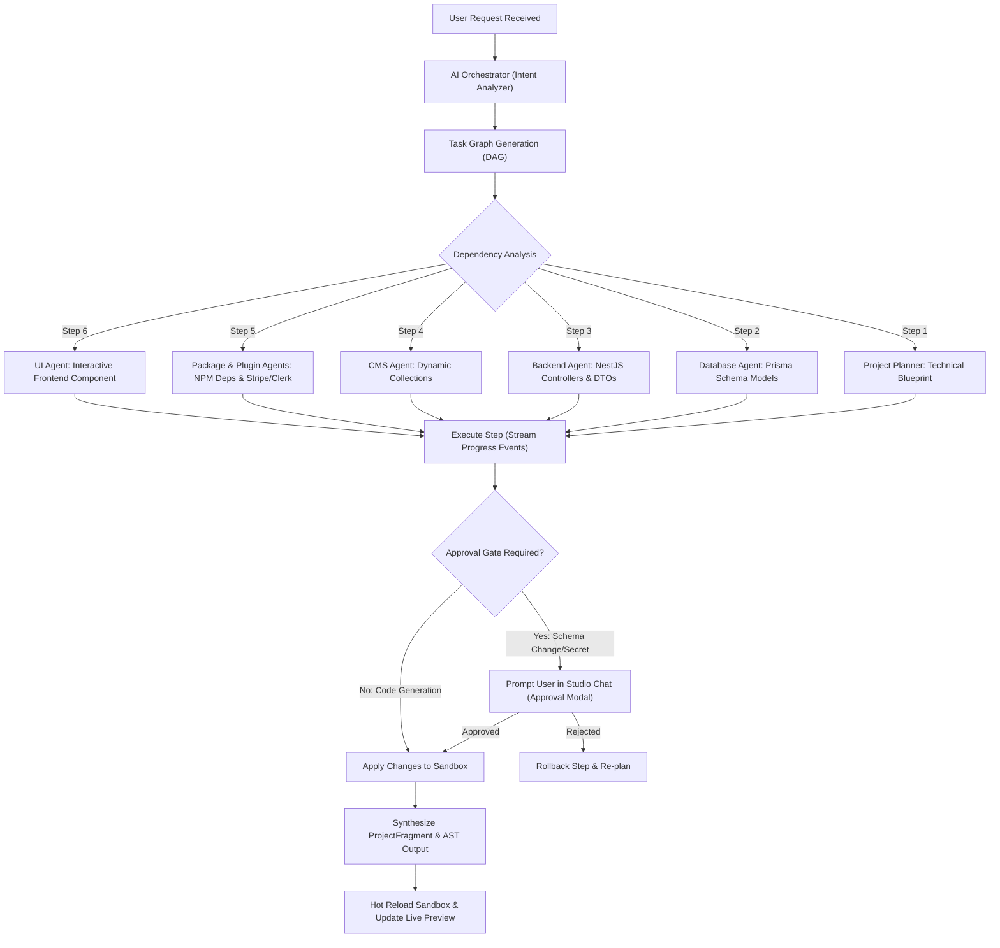

# PHASE 11 — AI AGENT ORCHESTRATION

**Product:** Nirmaanify AI  
**Document:** Master Phase Implementation Plan  
**Phase:** 11 — AI Agent Orchestration & Multi-Agent Architecture  
**Duration:** Week 32–33 (Sprint Cycles 32 & 33)  
**Target:** Specialized Agent Roster, Multi-Agent Orchestrator DAG Engine, 6-Layer Context Memory, Dual Design Context, and Studio Interactive Orchestration Chat  
**Audience:** AI Engineers, Platform Architects, Full-Stack Developers, Sandbox Engineers  
**Status:** ✅ FULLY IMPLEMENTED & VERIFIED  

---

## 1. Executive Summary & Core Architectural Rules

Modern full-stack web applications cannot be reliably built or maintained by a single monolithic AI prompt. Monolithic agents suffer from context dilution, hallucinated dependency versions, conflicting styling runtimes, and broken database-to-API contracts.

Phase 11 introduces a **Distributed Multi-Agent Architecture** orchestrated by a master planner.

### 1.1 The Golden Cardinal Rule

> **"Do not create one giant AI agent. Use specialized agents with scoped domain expertise, explicit tool boundaries, and a centralized orchestrator."**

```text
┌─────────────────────────────────────────────────────────────────────────────────────────────┐
│                                       USER REQUEST                                          │
│           "Build an E-Commerce Store with Stripe checkout, NestJS API, and Framer Motion"    │
└───────────────────────────────────────────┬─────────────────────────────────────────────────┘
                                            │
                                            ▼
┌─────────────────────────────────────────────────────────────────────────────────────────────┐
│                              AI AGENT ORCHESTRATOR (Master Coordinator)                     │
│   • Intent Analysis & Task Graph (DAG) Decomposition                                        │
│   • Dependency Routing (Database -> Backend -> UI -> Packages -> Plugins)                   │
│   • Progress Streaming, Human-in-the-Loop Approval Gates, Error Recovery & Retries          │
└───────────────────┬───────────────────────┬───────────────────────┬─────────────────────────┘
                    │                       │                       │
      ┌─────────────┴────────────┐          │         ┌─────────────┴────────────┐
      ▼                          ▼          │         ▼                          ▼
┌──────────────┐       ┌──────────────┐     │   ┌──────────────┐       ┌──────────────┐
│ProjectPlanner│       │   UI Agent   │     │   │Backend Agent │       │Database Agent│
│  (Sitemap/   │       │ (Next.js 15/ │     │   │ (NestJS 11/  │       │ (PostgreSQL/ │
│ Architecture)│       │  React 19)   │     │   │ REST APIs)   │       │Prisma Models)│
└──────────────┘       └──────────────┘     │   └──────────────┘       └──────────────┘
                                            ▼
                       ┌────────────────────────────────────────┐
                       │               CMS Agent                │
                       │    (Headless Collections & Schemas)    │
                       └────────────────────┬───────────────────┘
                                            │
                       ┌────────────────────┴───────────────────┐
                       ▼                                        ▼
             ┌──────────────────┐                     ┌──────────────────┐
             │  Package Agent   │                     │   Plugin Agent   │
             │(NPM Compatibility│                     │ (Stripe, Clerk,  │
             │ & Root Providers)│                     │ PostHog, Sandbox)│
             └──────────────────┘                     └──────────────────┘
```

### 1.2 The Dual Design Context Rule

Every UI generation and modification task receives a strongly typed `designContext`:

- **`platform` Context:** Strictly enforces the **Nirmaanify Design System** (`packages/design-tokens`, `packages/ui`, Nirmaan Indigo `#635BFF`, Radix UI, light/dark mode tokens). Used whenever the AI modifies Studio UI, internal inspectors, or platform views.
- **`project` Context:** Enforces the **User Project Theme** (user brand palette, user typography, selected UI framework e.g. `shadcn/ui` vs `Material UI`, selected animation library e.g. `framer-motion` vs `GSAP`, border radius tokens). Used whenever the AI generates application canvas code (`app/page.tsx`, components, layouts).

---

## 2. The 7 Specialized Agent Specifications

| Specialized Agent | Core Responsibilities | Input Context | Permitted Tool Calls & Outputs |
| :--- | :--- | :--- | :--- |
| **1. Project Planner Agent** | High-level system architecture, user stories, route tree, API contract definition. | User prompt, existing project blueprint, selected server architecture. | • `generateProjectPlan`<br>• `updateSitemap`<br>• `defineApiContract` |
| **2. UI Agent** | Next.js 15 App Router pages, React 19 client components, responsive Tailwind CSS layouts, animation triggers. | Project Design Context, component registry, page route specifications. | • `writeFrontendComponent`<br>• `updateLayout`<br>• `injectClientBoundary` |
| **3. Backend Agent** | NestJS 11 REST controllers, services, DTO validation with class-validator, Swagger OpenAPI documentation. | API contracts, entity definitions, authentication requirements. | • `generateNestModule`<br>• `createController`<br>• `createService`<br>• `generateDto` |
| **4. Database Agent** | PostgreSQL schemas, Prisma model definitions, relations, indices, seed scripts. | Domain entities, relation requirements, database driver config. | • `updatePrismaSchema`<br>• `generateMigration`<br>• `createDatabaseSeed` |
| **5. CMS Agent** | Workspace and project Headless CMS collections, field types, validation rules, sample content items. | Content modeling requirements, blog/e-commerce presets. | • `createCmsCollection`<br>• `addCmsField`<br>• `seedCmsItems` |
| **6. Package Agent** | Curated presets (`shadcn/ui`, `MUI`, `Framer Motion`, `GSAP`), NPM registry search, 4-tier compatibility validation, root provider injection. | Dependency requirements, Next.js 15 / React 19 compatibility matrix. | • `checkCompatibility`<br>• `installNpmPackage`<br>• `injectRootProvider` |
| **7. Plugin Agent** | Third-party integrations (Stripe payments, Clerk auth, PostHog analytics, Next SEO, Shopify sync), permission scopes, configuration secrets. | Plugin marketplace catalog, requested third-party services. | • `requestPluginPermissions`<br>• `configurePluginSecrets`<br>• `registerSlotHook` |

---

## 3. The 6-Layer Persistent Context Memory Engine

To ensure that each specialized agent operates with precise, hallucination-free knowledge of the project state, the Orchestrator injects a **6-Layer Context Memory Snapshot**:

```text
┌─────────────────────────────────────────────────────────────────────────────┐
│                          6-LAYER CONTEXT MEMORY                             │
├─────────────────────────────────────────────────────────────────────────────┤
│ 1. Project Context      │ Name, Slug, Type (SaaS, E-Com), Server Arch (BaaS)│
│ 2. Architecture Context │ File Tree, App Router Routes, Sandbox Endpoints   │
│ 3. Component Context    │ Existing UI Components, Layout Slots, Navbars     │
│ 4. Package Context      │ Installed Dependencies, Active UI/Animation Preset│
│ 5. Backend & DB Context │ Prisma Models, Active NestJS Modules, DB Tables   │
│ 6. Conversation Context │ Multi-turn History, Fragment Diffs, User Feedback │
└─────────────────────────────────────────────────────────────────────────────┘
```

1. **Layer 1 — Project Context:** Metadata, workspace slug, project ID, server type (`static`, `cms`, `nestjs`, `fullstack`), storage driver (`local`, `s3`, `vercel-blob`).
2. **Layer 2 — Architecture Context:** Active files in sandbox, Next.js 15 app router tree (`app/page.tsx`, `app/checkout/page.tsx`), API endpoints map (`/api/v1/products`).
3. **Layer 3 — Component Context:** List of pre-scaffolded visual components, header/footer layouts, visual builder slots.
4. **Layer 4 — Package Context:** Current UI library (`shadcn/ui`, `MUI`), animation engine (`framer-motion`, `gsap`), form engine (`react-hook-form`), list of installed packages and resolved peer dependencies.
5. **Layer 5 — Backend & Database Context:** Prisma schema models (`User`, `Product`, `Order`), database relations, active NestJS modules.
6. **Layer 6 — Conversation Context:** Previous user prompts, assistant thoughts, tool call history, and git/fragment diff rollbacks.

---

## 4. Orchestration Pipeline & Directed Acyclic Graph (DAG)



---

## 5. Database Schema Additions (`packages/database/prisma/schema.prisma`)

Enhance the existing AI Agent models to support orchestration, specialized agent routing, subtask DAGs, and memory snapshots:

```prisma
// ==========================================
// PHASE 11: AI AGENT ORCHESTRATION
// ==========================================

enum SpecializedAgentType {
  ORCHESTRATOR
  PROJECT_PLANNER
  UI_AGENT
  BACKEND_AGENT
  DATABASE_AGENT
  CMS_AGENT
  PACKAGE_AGENT
  PLUGIN_AGENT
}

enum TaskExecutionStatus {
  QUEUED
  IN_PROGRESS
  AWAITING_APPROVAL
  COMPLETED
  FAILED
  SKIPPED
}

model AgentOrchestrationRun {
  id              String               @id @default(uuid())
  projectId       String
  messageId       String?
  prompt          String               @db.Text
  status          TaskExecutionStatus  @default(QUEUED)
  plan            Json                 @default("[]") // Orchestration subtasks DAG
  contextSnapshot Json                 @default("{}") // 6-layer memory snapshot
  currentAgent    SpecializedAgentType @default(ORCHESTRATOR)
  logs            Json                 @default("[]") // Step-by-step reasoning logs
  error           String?              @db.Text
  startedAt       DateTime             @default(now())
  completedAt     DateTime?

  project         Project              @relation(fields: [projectId], references: [id], onDelete: Cascade)

  @@index([projectId])
  @@index([status])
  @@map("agent_orchestration_runs")
}
```

---

## 6. TypeScript Contracts (`packages/types/src/agent.ts`)

```typescript
export type SpecializedAgentType =
  | 'ORCHESTRATOR'
  | 'PROJECT_PLANNER'
  | 'UI_AGENT'
  | 'BACKEND_AGENT'
  | 'DATABASE_AGENT'
  | 'CMS_AGENT'
  | 'PACKAGE_AGENT'
  | 'PLUGIN_AGENT';

export type TaskExecutionStatus =
  | 'QUEUED'
  | 'IN_PROGRESS'
  | 'AWAITING_APPROVAL'
  | 'COMPLETED'
  | 'FAILED'
  | 'SKIPPED';

export interface OrchestrationTask {
  id: string;
  agent: SpecializedAgentType;
  title: string;
  description: string;
  dependencies: string[]; // Task IDs that must complete first
  status: TaskExecutionStatus;
  requiresApproval?: boolean;
  isApproved?: boolean;
  outputSummary?: string;
}

export interface AgentDesignContext {
  mode: 'platform' | 'project';
  brandTokens: {
    primaryColor: string;
    secondaryColor: string;
    accentColor: string;
    fontFamily: string;
    borderRadius: string;
  };
  uiFramework: string;       // e.g. "shadcn/ui", "@mui/material"
  animationEngine: string;   // e.g. "framer-motion", "gsap"
  formEngine: string;        // e.g. "react-hook-form", "formik"
}

export interface AgentMemoryContext {
  project: {
    id: string;
    name: string;
    type: string;
    serverType: string;
  };
  architecture: {
    routes: string[];
    filesCount: number;
    sandboxUrl?: string;
  };
  packages: Array<{ name: string; version: string; category: string }>;
  backend: {
    hasNestJs: boolean;
    hasCms: boolean;
    entities: string[];
  };
  designContext: AgentDesignContext;
}
```

---

## 7. Step-by-Step Implementation Roadmap

### Week 32 — AI Orchestrator Engine

#### Day 1: Orchestration Database Models & Shared Types
- [x] Add `SpecializedAgentType`, `TaskExecutionStatus`, and `AgentOrchestrationRun` to `packages/database/prisma/schema.prisma`.
- [x] Run `prisma db push` to synchronize PostgreSQL tables.
- [x] Add `OrchestrationTask`, `AgentDesignContext`, `AgentMemoryContext` types to `packages/types/src/agent.ts`.
- [x] Rebuild `@nirmaanify/types`.

#### Day 2: Intent Analyzer & DAG Task Decomposition Engine
- [x] Create `apps/api/src/agent/orchestrator/intent-analyzer.ts`.
- [x] Implement task graph builder breaking user requests into prioritized DAG subtasks with dependency resolution.
- [x] Implement approval gate classifier (detecting destructive database migrations, secret keys, or large refactors).

#### Day 3: Specialized Agent Implementations (Backend, Database, CMS)
- [x] Create `apps/api/src/agent/specialized/database-agent.ts` (Prisma schemas, relations).
- [x] Create `apps/api/src/agent/specialized/backend-agent.ts` (NestJS controllers, DTOs, services).
- [x] Create `apps/api/src/agent/specialized/cms-agent.ts` (Dynamic CMS collections).

#### Day 4: Specialized Agent Implementations (UI, Packages, Plugins)
- [x] Create `apps/api/src/agent/specialized/ui-agent.ts` (Next.js 15, React 19, Tailwind, animations).
- [x] Create `apps/api/src/agent/specialized/package-agent.ts` (NPM compatibility, provider wrappers).
- [x] Create `apps/api/src/agent/specialized/plugin-agent.ts` (Stripe, Clerk, PostHog configuration).

#### Day 5: Multi-Agent Orchestrator Service & Controller
- [x] Create `apps/api/src/agent/orchestrator/orchestrator.service.ts`.
- [x] Connect sequential & parallel agent dispatching loop.
- [x] Implement fragment synthesis combining outputs into a single cohesive project fragment.
- [x] Expose REST endpoints: `POST /api/v1/projects/:id/agent/orchestrate` and `GET /runs/:runId`.

---

### Week 33 — AI Design Context, Persistent Memory & Studio UI

#### Day 6: 6-Layer Context Memory Engine
- [x] Create `apps/api/src/agent/memory/context-memory.service.ts`.
- [x] Implement dynamic snapshot generators for all 6 layers (Project, Architecture, Component, Package, Backend, Conversation).
- [x] Implement token pruning to keep prompts concise, high-speed, and within model limits.

#### Day 7: Dual Design Context Engine
- [x] Create `apps/api/src/agent/memory/design-context.service.ts`.
- [x] Enforce strict distinction: `platform` tokens (Nirmaanify Design System) vs `project` tokens (User Theme).
- [x] Inject design tokens into UI Agent system prompt.

#### Day 8: Studio UI — Multi-Agent Orchestrator Chat
- [x] Create `apps/web/src/components/agent/AgentOrchestratorView.tsx`.
- [x] Display agent roster badges showing which agent is currently active (UI, Backend, DB, etc.).
- [x] Build interactive Task DAG viewer showing subtask statuses (`queued`, `in-progress`, `completed`).

#### Day 9: Approval Gate Modal & Rollback UI
- [x] Build task approval flow in `AgentOrchestratorView.tsx` for reviewing sensitive changes.
- [x] Wire 1-click Rollback button in Studio to restore previous fragment state.

#### Day 10: End-to-End Validation & Verification
- [x] Run full multi-agent flow test: User prompts "Create a Store with Stripe payments and products database" -> Orchestrator schedules Planner -> Database Agent creates models -> Backend Agent generates NestJS CRUD -> Plugin Agent configures Stripe -> UI Agent generates storefront -> Live preview hot-reloads.
- [x] Verify complete monorepo typecheck (`apps/api`, `apps/web`, `packages/*`).

---

## 8. Deliverable

```text
======================================================================
DELIVERABLE: MULTI-AGENT AI DEVELOPMENT SYSTEM
======================================================================
1. Complete Multi-Agent Orchestrator engine with DAG task routing.
2. 7 Specialized Agents (Planner, UI, Backend, DB, CMS, Package, Plugin).
3. 6-layer persistent context memory engine.
4. Dual design context engine (Platform Design System vs User Theme).
5. Interactive Studio UI with live agent avatars, task graph & approvals.
======================================================================
```
