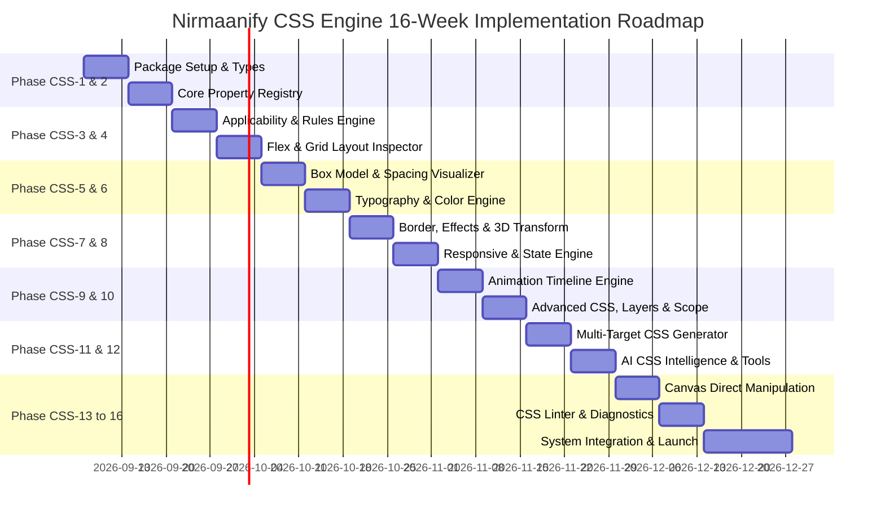

# Nirmaanify AI — Advanced CSS Intelligence & Visual Styling Engine
## Comprehensive Implementation Plan & Technical Architecture Specification

**Product:** Nirmaanify AI  
**Feature:** Advanced CSS Intelligence & Visual Styling Engine  
**Branch:** `feat/advanced-css-engine`  
**Target Package:** `packages/css-engine` & `apps/web/src/components/studio/`  
**Execution Roadmap:** 16 Weeks (Phases CSS-1 to CSS-12)  
**Status:** 📋 PROPOSED & PLANNED  

---

## 1. Executive Summary & Core Philosophy

The Nirmaanify AI **Advanced CSS Intelligence & Visual Styling Engine** is a deterministic, knowledge-based CSS engine designed for both human visual designers and autonomous AI coding agents. 

Rather than treating CSS as a collection of disjointed, hardcoded React input fields, the engine implements a **semantic knowledge graph of the web styling platform**:

```text
USER / AI SELECTS ELEMENT
        ↓
ELEMENT METADATA (Tag, semantic category, replaced element, child support)
        ↓
PARENT & ANCESTOR HIERARCHY (Display mode, flex/grid container context)
        ↓
CURRENT LAYOUT MODE (Block, inline, flow-root, flex, grid, absolute, sticky)
        ↓
CSS PROPERTY REGISTRY (Definitions, value schemas, syntax rules, browser support)
        ↓
APPLICABILITY & DEPENDENCY ENGINE (Filter invalid/conflicting properties)
        ↓
CONDITION & RESOLUTION ENGINE (Cascade, breakpoints, pseudo-classes, container queries)
        ↓
STYLE INSPECTOR & CANVAS GUIDES (Context-aware visual controls & direct manipulation)
        ↓
PROJECT STYLE SCHEMA (Framework-independent JSON AST)
        ↓
MULTI-TARGET CSS GENERATOR (Tailwind CSS, CSS Modules, Global CSS, Styled Components)
        ↓
PRODUCTION NEXT.JS 15 APP (React 19 + Zero-Runtime / Tree-Shaken CSS)
```

### Key Architectural Tenets:
1. **Knowledge Over Controls:** The UI is an emergent projection of the property applicability engine.
2. **Framework-Independent Schema:** Styles are stored as an abstract AST (e.g. `{ "display": "flex", "gap": "16px" }`), never as framework-locked class strings.
3. **AI Agent Compatibility:** AI tools query `getAvailableProperties()`, `validateCSSChange()`, and `applyStyleChange()` with full schema validation and reversible transactions.
4. **Cascade-Aware DevTools Experience:** Displays computed source (Browser Default, Project Theme, Component Rule, Responsive Override, Pseudo State).
5. **Design Token First:** Automatic token matching (e.g. suggests `var(--radius-lg)` instead of arbitrary `17px`).

---

## 2. Monorepo Package Architecture

We establish a dedicated package `@nirmaanify/css-engine` alongside extensions to the studio UI in `apps/web`:

```text
packages/
│
├── css-engine/                               # Core deterministic CSS knowledge package
│   ├── package.json
│   ├── tsconfig.json
│   ├── src/
│   │   ├── index.ts                          # Public API exports
│   │   │
│   │   ├── registry/                         # Complete CSS Platform Metadata
│   │   │   ├── properties/                   # 57 CSS Property categories
│   │   │   │   ├── layout.ts                 # display, overflow, visibility, box-sizing
│   │   │   │   ├── flexbox.ts                # flex-direction, justify-content, align-items, etc.
│   │   │   │   ├── grid.ts                   # grid-template-columns, grid-auto-flow, gaps, etc.
│   │   │   │   ├── box-model.ts              # width, height, margin, padding, logical props
│   │   │   │   ├── typography.ts             # font-family, font-size, line-height, clamp()
│   │   │   │   ├── colors.ts                 # color, background-color, oklch, lab, opacity
│   │   │   │   ├── backgrounds.ts            # multi-layer backgrounds, gradients
│   │   │   │   ├── borders.ts                # border, radius, outline, border-block
│   │   │   │   ├── effects.ts                # box-shadow, filters, backdrop-filter, blend modes
│   │   │   │   ├── transforms.ts             # 2D/3D translate, scale, rotate, perspective
│   │   │   │   ├── animations.ts             # transitions, keyframe animation engine
│   │   │   │   ├── scroll.ts                 # scroll-snap, scroll-behavior, overscroll
│   │   │   │   └── advanced.ts               # mask, clip-path, container-queries, @layer
│   │   │   ├── values/                       # CSS Value types, units & syntax validators
│   │   │   │   ├── units.ts                  # px, rem, em, %, vh, dvw, ch, fr
│   │   │   │   ├── functions.ts              # calc(), clamp(), min(), max(), var(), env()
│   │   │   │   └── presets.ts                # Keyword lookup tables
│   │   │   ├── elements/                     # HTML Element metadata & classifications
│   │   │   └── browser-support/              # Baseline compatibility warnings
│   │   │
│   │   ├── applicability/                    # Context Filter & Dependency Engine
│   │   │   ├── context-detector.ts           # Detect element + parent + layout mode
│   │   │   ├── rules-engine.ts               # Which properties are valid right now
│   │   │   └── conflict-detector.ts          # Flag conflicts (e.g. flex child + grid props)
│   │   │
│   │   ├── ast/                              # Framework-Independent Style Schema
│   │   │   ├── schema.ts                     # ElementStyle, ResponsiveStyle, StateStyles
│   │   │   ├── parser.ts                     # CSS string to Style Schema AST
│   │   │   └── serializer.ts                 # Style Schema AST to clean CSS
│   │   │
│   │   ├── cascade/                          # Style Resolution & Priority Engine
│   │   │   ├── resolver.ts                   # Computes final style given breakpoint & state
│   │   │   └── source-tracker.ts             # Tags style origin (Token, Component, Override)
│   │   │
│   │   ├── generator/                        # Multi-Target Code Generators
│   │   │   ├── tailwind-generator.ts         # Maps AST to Tailwind v3/v4 classes + arb values
│   │   │   ├── css-modules-generator.ts      # Generates scoped .module.css rules
│   │   │   ├── global-css-generator.ts       # Generates :root vars + utility sheets
│   │   │   └── optimizer.ts                  # Deduplication, tree-shaking, shorthand merges
│   │   │
│   │   └── ai/                               # AI CSS Agent Tools & Transactions
│   │       ├── style-tools.ts                # getAvailableProperties, validateCSSChange
│   │       ├── transaction-manager.ts        # Atomic, reversible style change patches
│   │       └── token-recommender.ts          # Matches raw values to design tokens
│   │
│   └── tests/                                # Comprehensive test suites
│
apps/web/src/components/studio/
│
├── inspector/                                # Refactored Modular Style Inspector
│   ├── StyleInspector.tsx                    # Main container with dynamic section ordering
│   ├── sections/                             # 14 Contextual Panels
│   │   ├── LayoutSection.tsx                 # Display mode, flex/grid container controls
│   │   ├── FlexItemSection.tsx               # align-self, flex-grow/shrink (child only)
│   │   ├── GridItemSection.tsx               # grid-column/row, justify-self (child only)
│   │   ├── SizeSection.tsx                   # Width, height, min/max, aspect-ratio
│   │   ├── SpacingSection.tsx                # Visual interactive Box Model (Margin & Padding)
│   │   ├── PositionSection.tsx               # Position, insets, z-index, containing block
│   │   ├── TypographySection.tsx             # Fonts, fluid typography (clamp), text-wrap
│   │   ├── BackgroundSection.tsx             # Multi-layer image, color & gradient editor
│   │   ├── BorderSection.tsx                 # 4-corner radius, borders, outline
│   │   ├── EffectsSection.tsx                # Multiple box shadows, blur & backdrop-filters
│   │   ├── TransformSection.tsx              # 2D/3D translate, rotate, scale, perspective
│   │   ├── AnimationSection.tsx              # Transitions & keyframe timeline preview
│   │   ├── ResponsiveStateSection.tsx        # Breakpoint selector + Pseudo states (:hover, :focus)
│   │   └── AdvancedCssSection.tsx            # Property search, custom variables, raw CSS editor
│   │
│   └── visualizers/                          # Interactive Canvas Visualizers
│       ├── BoxModelVisualizer.tsx            # Concentric margin/border/padding boxes
│       ├── FlexboxVisualizer.tsx             # Alignment direction & spacing interactive overlay
│       └── GridVisualizer.tsx                # Grid line guides, track resizing, span handles
```

---

## 3. Data Models & TypeScript Specifications

### 3.1 CSS Property Definition Metaschema
```typescript
export type CSSCategory =
  | 'layout'
  | 'flexbox'
  | 'grid'
  | 'box-model'
  | 'typography'
  | 'colors'
  | 'backgrounds'
  | 'borders'
  | 'effects'
  | 'transforms'
  | 'transitions'
  | 'animations'
  | 'scroll'
  | 'interactions'
  | 'advanced';

export type DisplayMode = 'block' | 'inline' | 'inline-block' | 'flex' | 'inline-flex' | 'grid' | 'inline-grid' | 'none' | 'contents';
export type LayoutContextMode = 'normal-flow' | 'flex-container' | 'flex-item' | 'grid-container' | 'grid-item' | 'positioned';

export interface PropertyDependency {
  target: 'parent' | 'self' | 'ancestor';
  property: string;
  expectedValues: string[];
}

export interface PropertyConflict {
  conflictingProperty: string;
  reason: string;
  severity: 'warning' | 'incompatible';
}

export interface CSSPropertyDefinition {
  name: string;
  label: string;
  category: CSSCategory;
  description: string;
  
  // Applicability criteria
  applicableElements?: string[]; // e.g. ['img', 'video'] for object-fit
  disallowedElements?: string[];
  displayModes?: DisplayMode[];  // applies when element's display is one of these
  layoutContext?: LayoutContextMode[]; // applies when element or parent is in layout mode
  dependencies?: PropertyDependency[];
  conflicts?: PropertyConflict[];

  // Value typing & intelligence
  valueType: ('length' | 'percentage' | 'color' | 'keyword' | 'gradient' | 'image' | 'track-list' | 'shadow')[];
  validKeywords?: string[];
  supportedFunctions?: ('calc' | 'min' | 'max' | 'clamp' | 'var' | 'env' | 'repeat' | 'minmax')[];
  defaultValue?: string;
  
  // Platform capabilities
  inherited: boolean;
  animatable: boolean;
  responsive: boolean;
  supportsVariables: boolean;
  supportsGlobalValues: boolean; // initial, inherit, unset, revert
  browserSupport?: {
    baseline: 'widely' | 'newly' | 'limited';
    minChrome?: number;
    minFirefox?: number;
    minSafari?: number;
  };
}
```

### 3.2 Framework-Independent Style Schema (AST)
```typescript
export interface StyleValue {
  value: string;
  source: 'default' | 'token' | 'component' | 'class' | 'override' | 'inline';
  tokenRef?: string; // e.g. "--color-primary"
}

export interface ResponsiveStyleObject {
  base?: Record<string, StyleValue>;
  sm?: Record<string, StyleValue>;
  md?: Record<string, StyleValue>;
  lg?: Record<string, StyleValue>;
  xl?: Record<string, StyleValue>;
  '2xl'?: Record<string, StyleValue>;
  containerQueries?: Array<{
    containerName?: string;
    condition: string; // e.g. "(min-width: 600px)"
    styles: Record<string, StyleValue>;
  }>;
}

export interface ElementStateStyles {
  normal: ResponsiveStyleObject;
  hover?: ResponsiveStyleObject;
  active?: ResponsiveStyleObject;
  focus?: ResponsiveStyleObject;
  focusVisible?: ResponsiveStyleObject;
  disabled?: ResponsiveStyleObject;
  checked?: ResponsiveStyleObject;
}

export interface ElementStyleAST {
  nodeId: string;
  states: ElementStateStyles;
  customClasses?: string[];
  scopedCustomCss?: string;
}
```

---

## 4. Context-Aware Applicability Engine

The applicability engine determines whether a property should be visible, disabled, or highlighted in the inspector:

```typescript
export interface EvaluationContext {
  element: {
    id: string;
    tagName: string;
    type: string;
    computedDisplay: DisplayMode;
    position: string;
  };
  parent?: {
    id: string;
    tagName: string;
    type: string;
    computedDisplay: DisplayMode;
  };
  ancestors?: Array<{
    id: string;
    computedDisplay: DisplayMode;
  }>;
}

export function evaluatePropertyApplicability(
  property: CSSPropertyDefinition,
  context: EvaluationContext
): { isApplicable: boolean; status: 'active' | 'inactive' | 'conflicted'; reason?: string } {
  // 1. Element Tag check
  if (property.applicableElements && !property.applicableElements.includes(context.element.tagName)) {
    return { isApplicable: false, status: 'inactive', reason: `Only applies to: ${property.applicableElements.join(', ')}` };
  }

  // 2. Parent Container Check (Flex item / Grid item)
  if (property.dependencies) {
    for (const dep of property.dependencies) {
      if (dep.target === 'parent') {
        if (!context.parent) return { isApplicable: false, status: 'inactive', reason: 'Requires a parent container' };
        const parentVal = context.parent.computedDisplay;
        if (!dep.expectedValues.includes(parentVal)) {
          return {
            isApplicable: false,
            status: 'inactive',
            reason: `Requires parent display: ${dep.expectedValues.join(' or ')} (parent is "${parentVal}")`
          };
        }
      }
    }
  }

  // 3. Self Display Check (Flex/Grid container properties)
  if (property.displayModes && !property.displayModes.includes(context.element.computedDisplay)) {
    return {
      isApplicable: false,
      status: 'inactive',
      reason: `Requires display: ${property.displayModes.join(' or ')} (currently "${context.element.computedDisplay}")`
    };
  }

  return { isApplicable: true, status: 'active' };
}
```

---

## 5. Multi-Target Code Generation Engine

The generator takes the `ElementStyleAST` and produces production code matching the project's configuration:

### Tailwind Generator Output
```tsx
// Input AST:
// { display: "flex", alignItems: "center", gap: "16px", padding: "24px" }
//
// Output JSX:
<div className="flex items-center gap-4 p-6 hover:shadow-lg transition-all">
```
*Maps exact token values to standard Tailwind utilities (`gap-4`, `p-6`) and falls back to arbitrary brackets (`p-[22px]`) only when custom values have no theme step.*

### CSS Modules Generator Output
```css
/* Card.module.css */
.card {
  display: flex;
  align-items: center;
  gap: var(--space-4, 16px);
  padding: var(--space-6, 24px);
  transition: box-shadow 0.2s ease;
}

.card:hover {
  box-shadow: var(--shadow-lg);
}

@media (max-width: 768px) {
  .card {
    flex-direction: column;
    padding: var(--space-4, 16px);
  }
}
```

---

## 6. Phased Implementation Roadmap (Weeks 1 to 16)



| Phase | Duration | Scope & Key Deliverables |
| :--- | :--- | :--- |
| **Phase CSS-1** | Week 1 | Create `@nirmaanify/css-engine` monorepo package; define core types, AST schemas, unit validators, and element classification dictionary. |
| **Phase CSS-2** | Week 2 | Implement Property Registry v1: Display, Box Model, Dimensions, Spacing, Position, and Overflow (all with keyword lookups). |
| **Phase CSS-3** | Week 3 | Context & Applicability Engine: Evaluate element tags, parent display modes, and layout contexts; detect property conflicts. |
| **Phase CSS-4** | Week 4 | Flexbox & Grid Container/Item Inspector: Container controls (direction, wrap, justify, align, gaps) and Item controls (order, grow, shrink, column/row spans). |
| **Phase CSS-5** | Week 5 | Box Model Visualizer: Concentric interactive margin, border, padding editor with unit switching (`px`, `rem`, `%`, `vw`, `vh`). |
| **Phase CSS-6** | Week 6 | Typography & Color Engine: Fluid typography (`clamp`), font family loader, OKLCH/HEX/RGBA picker, and multi-layer background editor. |
| **Phase CSS-7** | Week 7 | Borders, Effects & Transforms: Multi-corner border radius, multiple box shadows, backdrop filters, 2D/3D transforms with perspective. |
| **Phase CSS-8** | Week 8 | Responsive Overrides & Pseudo-Class Engine: Breakpoint selector (`base`, `sm`, `md`, `lg`, `xl`) and state switcher (`:hover`, `:active`, `:focus`, `:disabled`). |
| **Phase CSS-9** | Week 9 | Transition & Animation Timeline Engine: CSS transition presets, custom cubic-bezier editor, and keyframe timeline visualizer. |
| **Phase CSS-10** | Week 10 | Advanced CSS & Container Queries: Container queries (`@container`), custom properties (`var(--)`), `@supports`, `@layer`, clip-path shapes. |
| **Phase CSS-11** | Week 11 | Multi-Target Code Generator: Translates AST into optimized Tailwind CSS classes, CSS Modules, and Global CSS with deduplication and tree-shaking. |
| **Phase CSS-12** | Week 12 | AI CSS Intelligence: Agent tools (`getElementContext`, `validateCSSChange`, `applyStyleChange`), atomic transactions, and design token recommender. |
| **Phase CSS-13** | Week 13 | Canvas Direct Manipulation: Drag handles for padding, margin, column widths, and flex gap spacing directly on the visual canvas. |
| **Phase CSS-14** | Week 14 | CSS Linter & Compatibility Engine: Contrast warnings, missing focus-visible indicators, and browser support diagnostic badges. |
| **Phase CSS-15 & 16** | Weeks 15–16 | Final Integration & Studio Unification: Full integration into Visual Studio (`visual-studio-modal.tsx`), project export verification, and end-to-end testing. |

---

## 7. Immediate Next Step (Phase CSS-1 Kickoff)

With branch `feat/advanced-css-engine` created:
1. Initialize `@nirmaanify/css-engine` in `packages/css-engine`.
2. Configure TypeScript, build scripts, and monorepo workspace links in root `pnpm-workspace.yaml`.
3. Scaffold initial registries for property definitions and framework-independent style AST.
